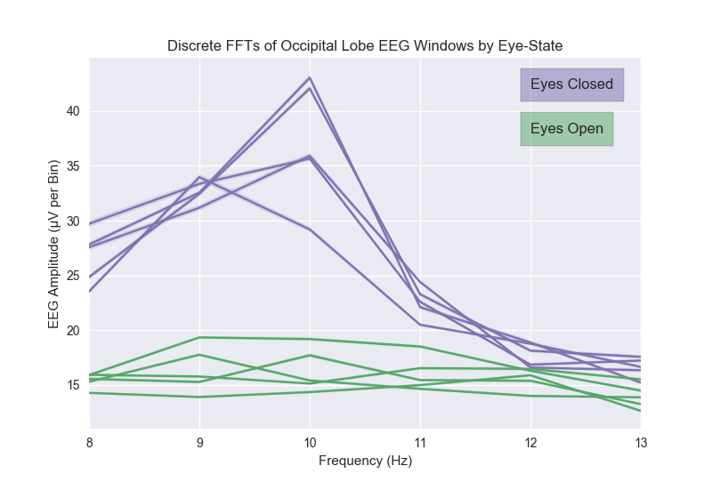

## Machine Learning for EEG (Electroencephalography) Affect Identification

### Background

This is the central repository for the [affect](https://en.wikipedia.org/wiki/Affect_(psychology))
identification project of [BrainLab](http://brainlab.gatech.edu/) @ the Georgia Tech School of Interactive Computing.
The goal of this project was to utilize various available machine learning
techniques to tackle the problem of affect identification in humans from EEG
using commercially available hardware.

### As a Classification Problem

[Statistical Classification](https://en.wikipedia.org/wiki/Statistical_classification)
attempts to address the problem of identifying, given a sample from an unknown distribution `X`,
the most likely category `C` it corresponds to. In our case, this means attempting to determine
the most probable state of an individual given a recent window of their EEG.

### As a Generative Modeling Problem

[Generative Modeling](https://en.wikipedia.org/wiki/Generative_model) in
contrast actually attempts to learn the entire underlying distribution of a set of
samples itself. With respect to our goals, this means attempting to
generate a realistic looking sample of a person's EEG given their current
state.

This can actually be used, through sampling, to address the classification problem of
determining the conditional probability of a given state using EEG. Although,
you also get the benefit of being able to draw an arbitrarily high number of
samples from a minniature version of the true underlying distribution, assuming
your generative model has converged correctly. (Tough assumption.)

